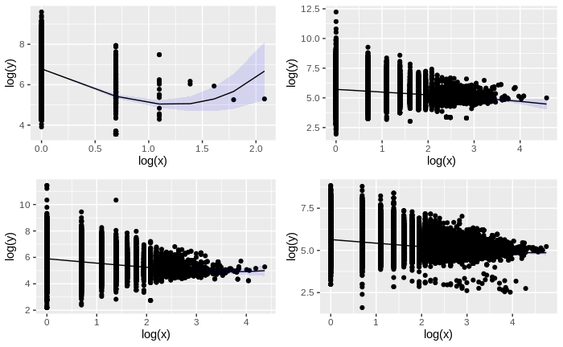

```{r, include = FALSE}
knitr::opts_chunk$set(
  collapse = TRUE,
  comment = "#>"
)
remotes::install_bioc("biomaRt")
```

```{r, setup, include=FALSE}
library(kableExtra)
options(tidyverse.quiet = TRUE)
```

Menzerath's law (also known as Menzerath-Altmann law) in linguistics describes the relationship between the size of a linguistic construct (e.g. a word) and its constituents (e.g. syllables), which are expected follow the relationship:

$$ y = a \cdot x^b \cdot e^{-cx} $$
where `a`, `b` and `c` are parameters of the law, `x` is the size of the construct measured in units of its constituents and `y` is the average size of constituents measured in units of a subconsistuent. Menzerath's law can apply to complex systems with multiple levels and has been found in other systems outside linguistics.

Menzerath's law has been found in a number of different biological sequences and organizational levels including:

- Genomes, chromosomes and base pairs [@FerrerICancho2009; @Baixeries2013]
- Genes, exons and base pairs [@Li2011] and perhaps more appropriately transcripts, exons and base pairs [@Nikolaou2014]
- Proteins, protein domains and aminoacids [@Shahzad2015]

To facilitate the exploration of Menzerath's law we can use the [menzerath R package](https://sellisd.github.io/menzerath/). Lets consider the case of the transcript-exon level as an example. We use [biomaRt](https://bioconductor.org/packages/release/bioc/html/biomaRt.html) package to give us access to the the biological data. The package is part of [Bioconductor](bioconductor.org) and provides an interface to BioMart databases such as [Ensemble](https://www.ensembl.org/), where we can download structural information for a number of genomes.


First we have to load the packages we are going to use (If any of the packages is missing check the [Install Missing Libraries section](#Install-missing-libraries-section)):

```{r, load_libraries}
library("tidyverse")
library("menzerath")
library("cowplot")
library("biomaRt")
```

Once everything is in place we can start by connecting to [ensemble](https://www.ensembl.org/index.html), a genome database project of the European Bioinformatics Institute, and list the databases (here are the first 20):

```{r, connect_ensemble}
ensembl <- useMart("ensembl")
datasets <- listDatasets(ensembl)
kbl(head(datasets,20))
```

Lots of interesting species are among the first top 20, difficult to choose which one to focus on. Cows have interesting things to [say](https://github.com/tnalpgge/rank-amateur-cowsay) so lets pick the database of the cow's genome (`btaurus_gene_ensembl`) for the following example.

A transcript is the transcribed part of a gene. By transcribed we mean that the genomic region will be used to produce a functional biomolecule (RNA which can then be used to direct the construction of a protein). A transcript can be composed by one or more exons.

The information we are interested in are transcripts and exons. Transcripts are uniquely identified by the attribute `ensembl_transcript_id` and exons by the attribute `ensembl_exon_id`. We also need the size of exons (in base pairs) and this we can calculate from the difference in the genomic coordinates of the start and end of each exon stored in the attributes `exon_chrom_start` and `exon_chrom_end` respectively. Finally we can reduce the noise in the data we download by excluding non-constitutive exons. To keep the amount of data manageable we also filter by a single chromosome:

```{r, download_data}
ensembl <- useMart("ensembl", dataset = "btaurus_gene_ensembl")
cow_exons <-  getBM(filters = 'chromosome_name',
                    values = 13,
                    attributes=c("ensembl_transcript_id",
                                 "ensembl_exon_id",
                                 "exon_chrom_start",
                                 "exon_chrom_end",
                                 "is_constitutive"), mart=ensembl)
```

There are `r nrow(cow_exons)` in our table, quite enough to get a statistical signal, with the drawback that we focus on a single chromosome which might have something particular.

To make sure that we did correctly downloaded the information we need we could have added a few more attributes and perform some descriptive statistics or data cleaning but for the purpose of this examples we can skip such steps.

Having downloaded the necessary information we can now process them to create a menzerath object to store the information:

```{r, process_data}
processed_exons <-(cow_exons %>% 
                     filter(is_constitutive==1) %>% 
                     mutate(exon_size = exon_chrom_end-exon_chrom_start) %>% 
                     group_by(ensembl_transcript_id) %>%
                     summarize(transcript_size = n(), average_exon_size=mean(exon_size)))

cow_menzerath <- menzerath(processed_exons, x = "transcript_size", y = "average_exon_size")
```

To get a glimpse of the information in our object we can print it:

```{r, print_menzerath}
print(cow_menzerath)
```

and plot the data:

```{r, plot_menzerath}
plot(cow_menzerath, fit = TRUE)
```

By default for the fit we use the Menzerath-Altman formula (for alternatives see section Alternative models of the vignette Introduction to package menzerath):

$$ y = a \cdot x^b \cdot e^{-cx} $$

We could explore a bit more in depth the data by trying a different formula for fitting:

```{r, parameters}
alt_fit <- fit(cow_menzerath, method="Milicka_2")
get_parameters(alt_fit)
```
Interpreting the meaning of the parameters in most cases is not straightforwards even in cases where the system is well known. To get a better understanding of Menzerath's law in the particular system one could also compare across systems. To make the process less repetitive we can define a helper function `ensemble2menzerath` to download the necessary information (see [Useful functions](#Useful-functions) for the full code).

As the following code is too heavy and time consuming as it requests and processes a lot of information, it has been pre-run and the resulting plot is directly inserted below:

```{r, eval = FALSE}
yms <- ensemble2menzerath()
hms <- ensemble2menzerath("hsapiens_gene_ensembl")
mms <- ensemble2menzerath("mmusculus_gene_ensembl")
cms <- ensemble2menzerath("btaurus_gene_ensembl")
yeast_plot <- plot(yms, fit = TRUE)
human_plot <- plot(hms, fit = TRUE)
mouse_plot <- plot(mms, fit = TRUE)
cow_plot <- plot(cms, fit = TRUE)
plot_grid(yeast_plot, human_plot, mouse_plot, cow_plot, ncol = 2)
```


| species | scientific name | database name              | number of observations |
|---------|-----------------|----------------------------|------------------------|
| yeast   | _S. cerevisiae_ | `scerevisiae_gene_ensembl` | 7,127                  |
| human   | _H. sapiens_    | `hsapiens_gene_ensembl`    | 52,351                 |
| mouse   | _M. musculus_   | `mmusculus_gene_ensembl`   | 43,864                 |
| cow     | _B. taurus_     | `btaurus_gene_ensembl`     | 42,022                 |




## Troubleshooting

### Install Missing Libraries {#Install-missing-libraries-section}

If [tidyverse](https://www.tidyverse.org/) or [cowplot](https://wilkelab.org/cowplot/index.html) is missing they can be installed with:

```{r, install_missing_libraries_1, eval=FALSE}
install.packages(c"tidyverse", "cowplot")
```

If [menzerath](https://sellisd.github.io/menzerath/) is missing: 

```{r, install_missing_libraries_2, eval=FALSE}
install.packages("devtools")
devtools::install_github("sellisd/menzerath", build_vignettes=TRUE)
```

If [biomaRt](https://bioconductor.org/packages/release/bioc/html/biomaRt.html) is it can be installed with the following commands (this might take some time): 

```{r, install_missing_libraries_3, eval=FALSE}
if (!requireNamespace("BiocManager", quietly = TRUE))
    install.packages("BiocManager")

BiocManager::install("biomaRt")
```

## Useful functions {#Useful-functions}

The full code for the helper function is the following:

```{r, define_function}

#' Generate a menzerath object from exons
#'
#' @param dataset the name of an ensemble dataset by default one for _S. cerevisiae_
#'
#' @return
#' @export
#'
#' @examples
ensemble2menzerath <- function(dataset = "scerevisiae_gene_ensembl", ...){
  ensembl = useMart("ensembl", dataset = dataset)
  print("Downloading...")
  exons <- getBM(attributes=c("ensembl_transcript_id",
                              "transcript_length",
                              "ensembl_exon_id",
                              "exon_chrom_start",
                              "exon_chrom_end",
                              "is_constitutive", ...), mart=ensembl)
  print("done")
  processed <-(exons %>% 
                 filter(is_constitutive==1) %>% 
                 mutate(exon_size = exon_chrom_end-exon_chrom_start) %>% 
                 group_by(ensembl_transcript_id) %>%
                 summarize(transcript_size = n(), average_exon_size=mean(exon_size)))
  
  ms <- menzerath(processed, x = "transcript_size", y = "average_exon_size")
}
```

# References
